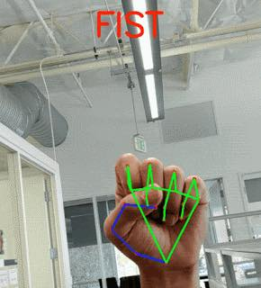

# Hand-Gesture-Tracking-AI-for-Mobile-Devices.-

Thanks to @GoogleAI for open-sourcing hand gesture tracking AI for mobile devices.‬

‪Awesome hand perception functionality infers up to 21 3D points of a hand (or multiple hands) on a mobile phone from just a single frame.

‬

Learn more at https://ai.googleblog.com/2019/08/on-device-real-time-hand-tracking-with.html
‪
Check it on GitHub: https://github.com/…/medi…/docs/hand_tracking_mobile_gpu.md‬
